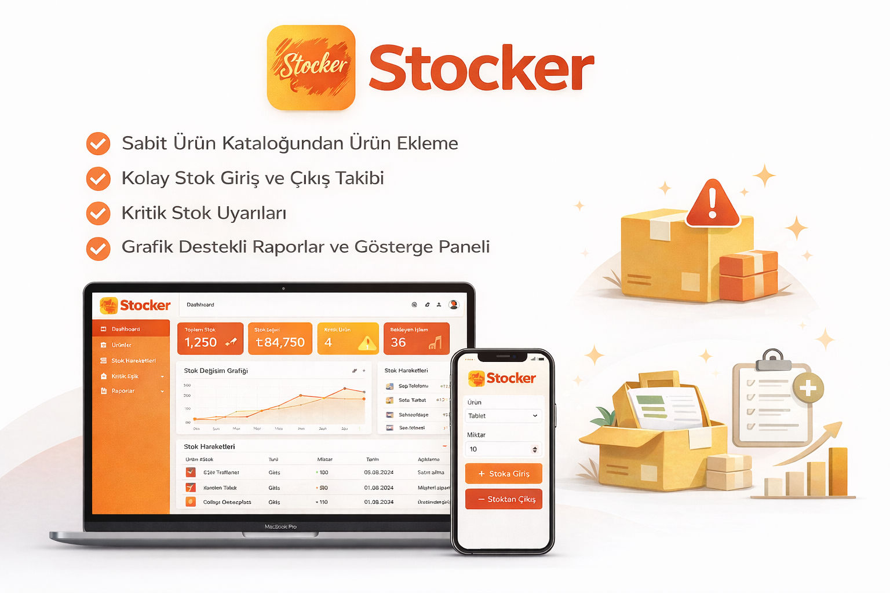

# Stocker — Envanter Yönetim Sistemi

---

## Proje Hakkında

**Proje Tanımı:**
Stocker, küçük ve orta ölçekli işletmeler için geliştirilmiş web tabanlı bir envanter (stok) yönetim sistemidir. Sabit bir ürün kataloğundan ürün eklenebilir; stoka giriş / stoktan çıkış işlemleri kaydedilir ve tüm hareketler geçmişiyle izlenebilir. Kritik stok eşiği aşıldığında görsel uyarılar gösterilir; özet raporlar ve grafik destekli gösterge paneli ile stok durumu anlık olarak takip edilebilir.

**Proje Kategorisi:** Stok / Envanter Yönetimi

---

## Proje Linkleri

- **Web Frontend:** [stocker-olive.vercel.app](https://stocker-olive.vercel.app)
- **REST API (Backend):** [stocker-vou5.vercel.app](https://stocker-vou5.vercel.app)
- **Swagger API Dokümantasyonu:** [stocker-vou5.vercel.app/api/docs](https://stocker-vou5.vercel.app/api/docs)

---

## Teknoloji Yığını

| Katman | Teknoloji |
|--------|-----------|
| Frontend | React 18, Vite 5, React Router v6 |
| Backend | Node.js, Express, Mongoose |
| Veritabanı | MongoDB Atlas |
| Deploy | Vercel (frontend + backend ayrı projeler) |
| API Dokümantasyonu | Swagger UI (OpenAPI 3.0) |

---

## Proje Ekibi

**Grup Adı:** Stocker

**Ekip Üyeleri:**
- Büşra Mangaoğlu

---

## Dokümantasyon

1. [Gereksinim Analizi](Gereksinim-Analizi.md)
2. [REST API Tasarımı](API-Tasarimi.md)
3. [REST API](Rest-API.md)
4. [Web Front-End](WebFrontEnd.md)
5. [Mobil Front-End](MobilFrontEnd.md)
6. [Mobil Backend](MobilBackEnd.md)
7. [Video Sunum](Sunum.md)

